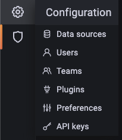
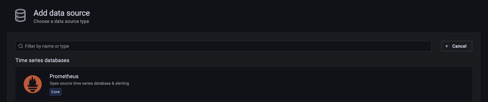
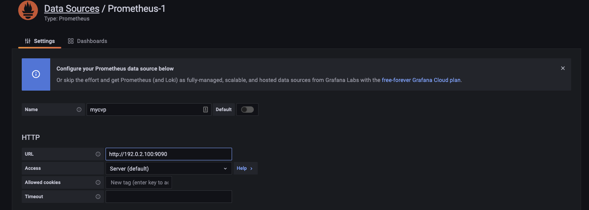
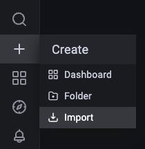
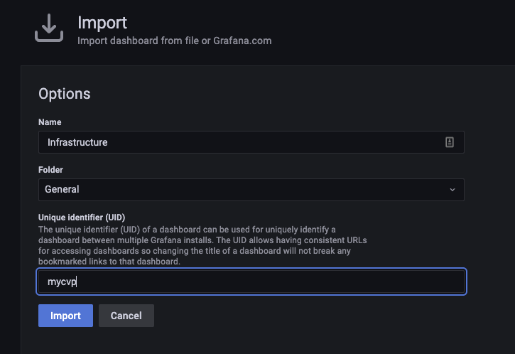
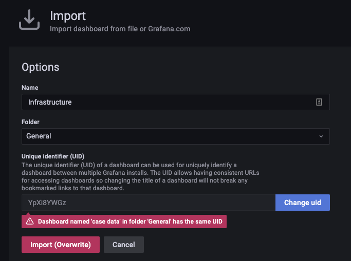
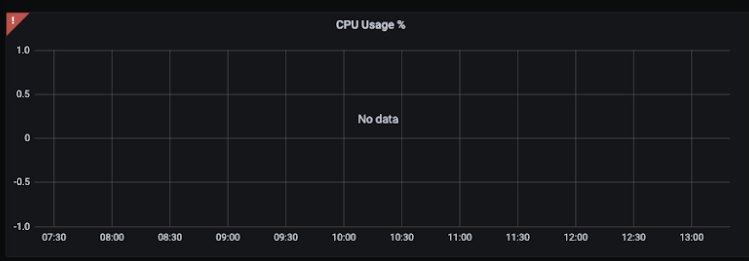
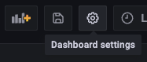
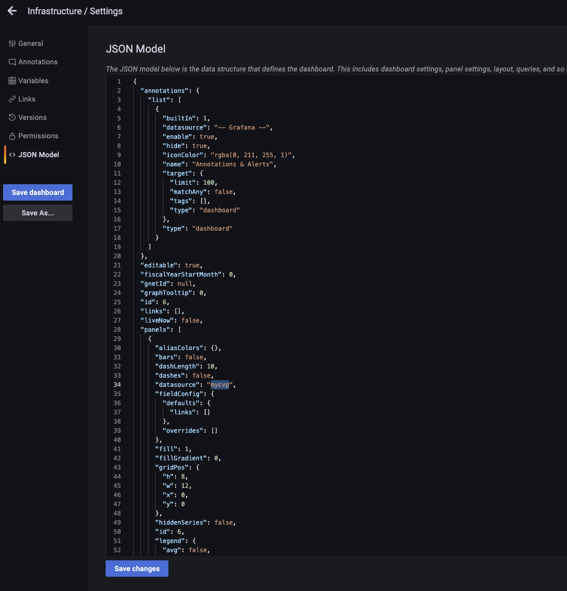
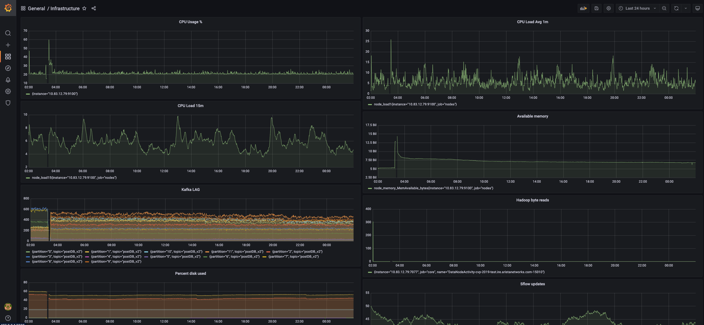

# Monitoring CloudVision with Prometheus and Grafana

CVP is runs on CentOS and prometheus node-exporter is used to collect various metrics both from the VM (memory and CPU usage, disk latency, writes/reads per second, etc) and the application’s components. These metrics can be viewed by accessing the Prometheus UI or creating dashboards in Grafana.

# Exposing Prometheus on CloudVision

1\. To be able to setup the Prometheus datasource in Grafana, TCP 9090 has to be allowed on the primary node’s firewalld (Note that in newer releases this is already enabled). There are two ways to do this:

a) Using the firewall-cmd CLI command:

`firewall-cmd --permanent --add-port=9090/tcp --zone=eth0-Zone && firewall-cmd --reload`

After applying this command a success message should be printed on stdout.

b) Manually editing `/etc/firewalld/zones/eth0-Zone.xml` and adding the port similarly to how others are added, e.g.:

`<port protocol="tcp" port="9090"/>`

Make sure to save the file in this case before exiting. The file’s first 15 lines should look like this:

```shell
[root@cvp11 ~]# cat /etc/firewalld/zones/eth0-Zone.xml | head -n 15
<?xml version="1.0" encoding="utf-8"?>
<zone>
  <interface name="eth0"/>
  <service name="dhcpv6-client"/>
  <service name="http"/>
  <service name="ssh"/>
  <service name="https"/>
  <port protocol="tcp" port="9910"/>
  <port protocol="tcp" port="8090"/>
  <port protocol="udp" port="3851"/>
  <port protocol="tcp" port="4433"/>
  <port protocol="tcp" port="8443"/>
  <port protocol="udp" port="161"/>
  <port protocol="tcp" port="9090"/>
  <rule family="ipv4">
```

2\. After this is done, firewalld has to be restarted in order for the new rule to be applied.

`firewall-cmd --reload`

After applying this command a success message should be printed on stdout.

Quickly test if we can connect to that port from the remote end:

```
nc -zv 192.0.2.100 9090
Connection to 192.0.2.100 port 9090 [tcp/websm] succeeded!
```

If the response is “Connection refused” it would mean that there’s a Firewall in the middle that’s blocking the connection.

# Building Grafana container

If you don't already have a container, after cloning this repo, docker-compose can be used to bring up the containers:

1\. `git clone https://github.com/arista-netdevops-community/cvp-monitoring.git`
2\. `cd cvp-monitoring` 
3\. Run `docker-compose up -d`. 

That should build a local Prometheus and Grafana container preloaded with the dashboards and various metrics. 

> Note that the local Prometheus container would be only needed if offline the CVP data would want to be checked out and not necessary 
> for real-time monitoring.

The next steps would be to add your Prometheus data-source described in [Adding Prometheus to your Grafana instance](#adding-prometheus-to-your-grafana-instance). The same steps would be used for existing Grafana containers as well.

# Adding Prometheus to your Grafana instance

1\. Access your Grafana UI and add a new data source by clicking on the Gear icon on the left pane and select `Data Sources`



2\. Select the Prometheus template and fill in the form:




3\. Save & Test.

4\. Now let’s create the dashboards, you can create new dashboards or import them from a JSON file. In the below example importing via JSON is demonstrated. Click on the “+” sign on the left pane and select Import:



[grafana-prom.json](./grafana/provisioning/dashboards/grafana-prom.json)

[grafana-apiserver.json](./grafana/provisioning/dashboards/grafana-apiserver.json)

5\. You can either import via panel json or upload the .json file.
Select upload .json file



6\. Select the json file from your local PC/laptop, if the file is correct, we’ll be able to set the name of the dashboard, the folder where we’ll store it and the uid of the dashboard which has to be unique.



Simply renaming the UID to an arbitrary name is enough.

7\. After clicking import the dashboards should show up. In the JSON file the name of the datasource is Prometheus, so if the dashboards are not showing any data and the exclamation mark is shown on the top left of each graph like below, we just simply need to replace the datasource name from Prometheus to the one we chose initially (this can be also done prior to importing the JSON file):



8\. To make the modifications in Grafana, click on the Gear icon aka Dashboard settings (top right this time)



9\. Select JSON model from the left pane (there’s a delay of 5-10 seconds until the JSON model will show up) and replace all instances of `"datasource": "Prometheus"` with the correct datasource name, e.g. in below case it’s `"datasource": "mycvp"`, as mycvp was the name of the datasource chosen in step 4.



10\. Hit Save and you should see your dashboards like below:



# Loading offline Prometheus data

1\. Download this project
2\. Get the Prometheus tarball from CVP.

Option1)

```shell
cvpi stop prometheus
cd /data
tar -zcvf prometheus_data.tar.gz prometheus
cvpi start prometheus
```

Option2)

```shell
cvpi debug --prometheus
```

This will generate the debug tarball which will have the tarball inside
e.g.: `cvpi_debug_all_20220307224437/prometheus/prometheus_data.tar.gz`

3\. Untar the prometheus folder into the same folder you saved this project
`tar -zxvf prometheus_data.tar.gz`

4\. Run: `docker-compose up -d`

5\. Access grafana at `localhost:3000` or prometheus at `localhost:9090`

# Useful metrics

If using  ssh tunnel e.g.: `ssh -nNT -L 9090:localhost:9090 root@<CVP_IP>` the following links will work directly. Otherwise, replace `localhost` with your CloudVision FQDN or IP.

## General server metrics:

Load Average: [node_load1](http://localhost:9090/graph?g0.range_input=12h&g0.expr=node_load1&g0.tab=0)

Better look at cpu %: [100 - (avg by (instance) (irate(node_cpu_seconds_total{mode="idle"}[5m])) * 100)](http://localhost:9090/graph?g0.expr=100%20-%20(avg%20by%20(instance)%20(irate(node_cpu_seconds_total%7Bmode%3D%22idle%22%7D%5B5m%5D))%20*%20100)&g0.tab=0&g0.stacked=0&g0.show_exemplars=0&g0.range_input=1w)

I/O wait: [avg by (instance) (irate(node_cpu_seconds_total{mode="iowait"}[5m])) * 100](http://localhost:9090/graph?g0.range_input=6h&g0.expr=avg%20by%20(instance)%20(irate(node_cpu_seconds_total%7Bmode%3D%22iowait%22%7D%5B5m%5D))%20*%20100&g0.tab=0)

Disk writes per second: [irate(node_disk_written_bytes_total[2m])](http://localhost:9090/graph?g0.range_input=1h&g0.expr=irate(node_disk_written_bytes_total%5B2m%5D)&g0.tab=0)

Disk reads a second: [irate(node_disk_read_bytes_total[2m])](http://localhost:9090/graph?g0.range_input=1h&g0.expr=irate(node_disk_read_bytes_total%5B2m%5D)&g0.tab=0)

Hadoop bytes read: [irate(hadoop_datanode_bytesread[2m])](http://10.83.12.79:9090/graph?g0.range_input=12h&g0.expr=irate(hadoop_datanode_bytesread%5B2m%5D)&g0.tab=0)

Percent disk used: [100 - ((node_filesystem_avail_bytes * 100) / node_filesystem_size_bytes)](http://localhost:9090/graph?g0.range_input=8w&g0.expr=100%20-%20((node_filesystem_avail_bytes%20*%20100)%20%2F%20node_filesystem_size_bytes)&g0.tab=0)

Available memory: [node_memory_MemAvailable_bytes](http://localhost:9090/graph?g0.expr=node_memory_MemAvailable_bytes&g0.tab=0&g0.stacked=0&g0.show_exemplars=0&g0.range_input=1w)

## Per-process metrics:

memory utilization: [process_resident_memory_bytes](http://localhost:9090/graph?g0.range_input=1d&g0.expr=process_resident_memory_bytes&g0.tab=0)

Cpu utilization: http://localhost:9090/graph?g0.range_input=1d&g0.expr=irate(process_cpu_seconds_total%5B5m%5D)&g0.tab=0

Kafka lag for dispatcher: [max(kafka_log_log_value{topic="postDB_v2", name="LogEndOffset"}) by (partition, topic) - max(offset_consumed{topic="postDB_v2"}) by (topic, partition)](http://localhost:9090/graph?g0.range_input=1h&g0.expr=max(kafka_log_log_value%7Btopic%3D%22postDB_v2%22%2C%20name%3D%22LogEndOffset%22%7D)%20by%20(partition%2C%20topic)%20-%20max(offset_consumed%7Btopic%3D%22postDB_v2%22%7D)%20by%20(topic%2C%20partition)&g0.tab=0)
The Kafka LAG, shows us how many messages are in the queue per Kafka partitions. Having high number of messages in the queue can lead to performance issues, either because of resource constraints or more devices are streaming than are supported and the scale limit is being hit.

## Flow Data collection
number of flows per second for the last 5 minutes: [sum(rate(clover_ingest_num_notifications_received{type=~"ipfix|int|greent"}[5m]))](http://localhost:9090/graph?g0.range_input=1w&g0.expr=sum(rate(clover_ingest_num_notifications_received%7Btype%3D~%22ipfix%7Cint%7Cgreent%22%7D%5B5m%5D))&g0.tab=0)

Many more are included in the json files in `./grafana/provisioning/dashboards/`.

# Ask a question

Easiest way to get support is to open an [issue](https://github.com/arista-netdevops-community/cvp-monitoring/issues).